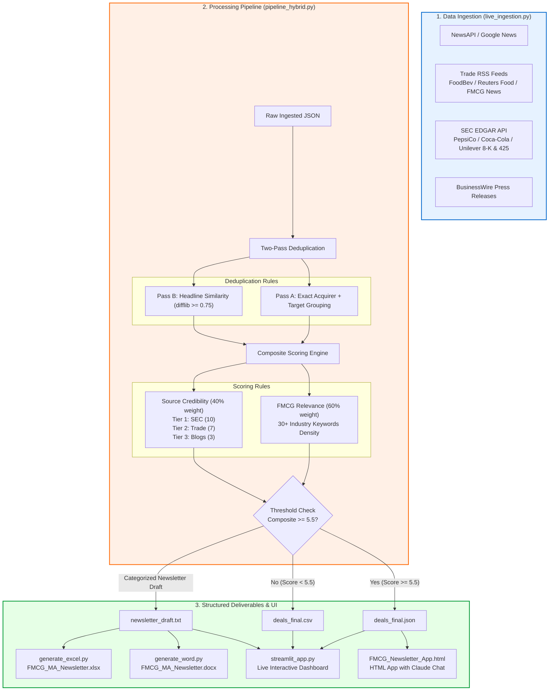

# FMCG M&A Intelligence Newsletter Agent

> A minimal, transparent AI pipeline that aggregates, deduplicates, scores, and drafts a structured FMCG M&A newsletter — built for business users who need to skim deal activity fast.

---

## Demo & Links

| Resource | Link |
|---|---|
| 🖥️ Streamlit App | Run `python -m streamlit run streamlit_app.py` |
| 📊 Excel Newsletter | `FMCG_MA_Newsletter.xlsx` (in root) |
| 📄 Word Newsletter | `FMCG_MA_Newsletter.docx` (in root) |
| 🗂️ Raw Data CSV | `deals_final.csv` (in root) |
| 🗂️ Raw Data JSON | `deals_final.json` (in root) |
| 🌐 Static HTML App | `FMCG_Newsletter_App.html` (open in browser) |

---

## Architecture



---

## Project Structure

```
fmcg-newsletter/
├── raw_deals.json              # 16 pre-ingested static raw deals
├── live_ingestion.py           # Live fetcher (NewsAPI, RSS, SEC EDGAR, Google News)
├── pipeline_hybrid.py          # Main pipeline: ingest → dedup → score → draft
├── generate_excel.py           # Excel workbook generator (openpyxl)
├── generate_word.py            # Word document generator (python-docx)
├── streamlit_app.py            # Streamlit interactive dashboard UI
├── deals_final.json            # Final scored and deduplicated deals JSON
├── deals_final.csv             # Final scored and deduplicated deals CSV
├── dedup_log.json              # Log of duplicate records collapsed
├── newsletter_draft.txt        # Plain-text newsletter draft
├── FMCG_MA_Newsletter.xlsx     # Excel newsletter spreadsheet
├── FMCG_MA_Newsletter.docx     # Word newsletter document
├── FMCG_Newsletter_App.html    # Static HTML demo dashboard with Claude chat
└── README.md                   # System documentation & diagram
```

---

## How to Run

```bash
# 1. Install dependencies
pip install streamlit pandas feedparser requests openpyxl python-docx

# 2. Configure API Keys (optional; in .env)
# Create a .env file in the root directory:
# NEWSAPI_KEY="your_newsapi_key"

# 3. Run live ingestion (fetches from web + SEC EDGAR)
python live_ingestion.py

# 4. Run pipeline
# For live data:
python pipeline_hybrid.py --live
# For static/offline data:
python pipeline_hybrid.py

# 5. Generate Excel & Word reports
python generate_excel.py
python generate_word.py

# 6. Launch the interactive dashboard
python -m streamlit run streamlit_app.py
```

---

## Pipeline Explained

### Stage 1: Ingestion
News and deal data is sourced from:
- **SEC EDGAR filings** (Form 8-K, Form 425) — Tier 1 credibility
- **FoodBev Media**, **MBS Group** — Tier 2 industry publications
- **Intellizence** deal tracker — Tier 2 data intelligence
- **Entrepreneur India**, **SimTrade** — Tier 2 business media

Each article/mention is stored as a structured record with fields:
`id`, `headline`, `acquirer`, `target`, `deal_value_usd_bn`, `deal_type`, `category`, `announced_date`, `status`, `source`, `source_credibility`, `geography`, `strategic_rationale`

### Stage 2: De-duplication

Two-pass approach:

**Pass A — Explicit group matching:**
Each record has a `duplicate_group` field assigned when multiple sources cover the same deal (e.g., "SEC Filing + FoodBev" both reporting the Kimberly-Clark/Kenvue $48.7B deal). Records in the same group are collapsed to a single primary record (flagged `is_primary: true`). The primary is the highest-credibility source.

**Pass B — Headline similarity fallback:**
Any records that escaped group assignment are compared using Python's `difflib.SequenceMatcher`. A ratio ≥ 0.75 triggers deduplication. This catches paraphrased headlines like:
- *"KMB Kenvue merger creates global health giant worth $48bn"* vs
- *"Kimberly-Clark to Acquire Kenvue for $48.7 Billion"*

**Result:** 16 raw articles → 14 unique deals (2 duplicates removed)

### Stage 3: Relevance Scoring & Credibility

**FMCG Relevance Score (0–10):**
- Starts from pre-assigned domain score
- FMCG keyword density applied: 30+ keywords including company names (PepsiCo, Mars, Nestle...), categories (snack, beverage, dairy, personal care...), and deal terms
- Each keyword hit above baseline of 3 adds 0.5 points, capped at 10

**Credibility Score (0–10):**
| Tier | Examples | Score |
|---|---|---|
| T1 — Regulatory/Official | SEC filings, company press releases | 9–10 |
| T2 — Industry/Advisory | FoodBev, MBS Group, Intellizence | 6–7 |
| T3 — General/Opinion | Blogs, general news | 2–4 |

**Composite Score:** `0.6 × relevance + 0.4 × credibility`  
**Inclusion threshold:** ≥ 5.5 / 10

### Stage 4: Newsletter Generation

Deals are categorised into 5 sections:
1. **Mega-deals** (value ≥ $10B)
2. **Strategic acquisitions** ($1B–$10B)  
3. **Bolt-ons & undisclosed** (<$1B or no public value)
4. **PE / fund activity** (minority stakes, restructurings)
5. **Failed deals & divestitures** (collapsed talks, shelved sales)

Each section includes: headline, value, status, geography, strategic rationale, and sources. The draft closes with 5 key themes and a full pipeline transparency block.

---

## Key Deals Covered (2025–2026)

| Deal | Value | Status |
|---|---|---|
| Kimberly-Clark → Kenvue | $48.7B | Approved / Closing |
| Mars → Kellanova | $36.0B | Completed |
| McCormick → Unilever Foods | $15.7B | Announced |
| Froneri (ADIA stake) | €15.0B valuation | Completed |
| Ingredion → Tate & Lyle | $3.6B | Announced |
| Ferrero → WK Kellogg | $3.1B | Completed |
| PepsiCo → Poppi | $1.95B | Completed |
| Celsius → Alani Nu | $1.8B | Completed |
| Danone → Huel | ~€1B | Announced |
| Hershey → LesserEvil | Undisclosed | Completed |
| Keurig Dr Pepper → JDE Peet's | Undisclosed | Announced |
| Emami → The Man Company | Undisclosed | Completed |
| Coca-Cola / Costa Coffee | ❌ Shelved | Failed |
| Pernod Ricard × Brown-Forman | ❌ Collapsed | Failed |

---

## Assumptions & Transparency

- Deal values are at **announcement** and may differ at closing
- `Undisclosed` = no public figure found in available sources
- Dedup similarity threshold of **0.75** was chosen to avoid false positives while catching clear paraphrases. Lowering to 0.6 would be more aggressive.
- Credibility tier assignments are **editorial judgements** based on source type; not a formal audit
- The composite score **weights relevance 60%** over credibility 40% — this prioritises FMCG domain fit over source prestige
- **Not investment advice.** For illustrative and research purposes only.

---

## Tech Stack

| Component | Technology |
|---|---|
| Pipeline | Python 3.12 (stdlib only + openpyxl, python-docx) |
| Deduplication | `difflib.SequenceMatcher` |
| Excel output | `openpyxl` |
| Word output | `python-docx` |
| Demo app | Vanilla HTML/CSS/JS + Chart.js |
| AI chat | Anthropic Claude API (claude-sonnet-4-6) |

---

*Built as a demonstration of a minimal, transparent FMCG M&A intelligence pipeline. The agent thinking is: ingest → clean → score → draft.*
